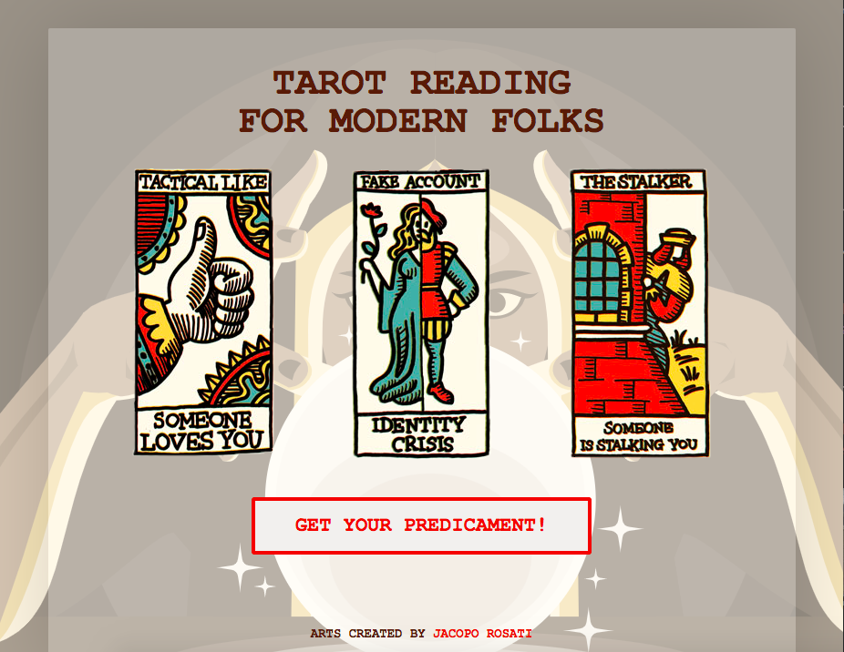

# Tarot reading

> It's a funny prediction game. 

## Table of contents
## Table of contents
* [General info](#general-info)
* [Screenshots](#screenshots)
* [Technologies](#technologies)
* [Setup](#setup)
* [Features](#features)
* [Status](#status)
* [Inspiration](#inspiration)
* [Contact](#contact)

## General info
It's a study progect from Codecademy course.
The task:
>>Build a message generator program. Every time a user runs a program, they should get a new, randomized output. To make your program truly random, the message that it outputs should be made up of at least three different pieces of data.

## Screenshots

## Technologies
* HTML5
* SCSS
* JavaScript
* Command line
* [Fisher–Yates Shuffle algorithm](https://en.wikipedia.org/wiki/Fisher%E2%80%93Yates_shuffle)

## Setup
Go to Github Pages site: [Tarot Reading](https://berserk-m.github.io/tarot-reading/)

## Inspiration
I was inspired by Jacopo Rosati's [artwork](https://jacoporosati.com/The-Social-Network-Tarots) and decided to increase his idea and create a full tarot reading tool

## Contact
Created by Anastasiya Mazhid 